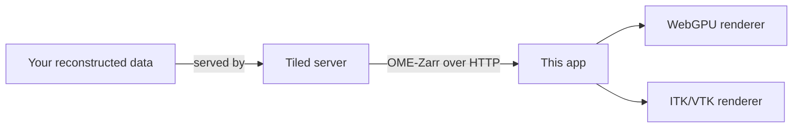

# Tomography Reconstruction Visualizer

The Tomography Reconstruction Visualizer is a web application for browsing and rendering large
tomographic reconstruction volumes (OME-Zarr) served by [Bluesky Tiled](https://blueskyproject.io/tiled/).
It's built for ALS beamline 8.3.2, but works with any Tiled server exposing OME-Zarr data.

It ships two rendering engines you can switch between at any time:

- **WebGPU renderer** — a custom, GPU-accelerated volumetric ray-marching renderer built for this app.
  Supports transfer functions, cropping, oblique/orthogonal slicing, lighting, masks/annotations, and a
  linked 2D + 3D split view. Requires a browser with WebGPU support, served over HTTPS (or `localhost`).
- **ITK/VTK renderer** — the original [itk-vtk-viewer](https://kitware.github.io/itk-vtk-viewer/)-based
  renderer. Works everywhere WebGPU doesn't (older browsers, plain HTTP).

## Where to start

- :material-download: **New to the app?**
  Start with [Installation (Docker)](getting-started/installation.md), then
  [load your first dataset](getting-started/first-dataset.md).

- :material-cube-outline: **Want to know what the viewer can do?**
  Jump into the [Features](features/tabs-and-splits.md) section — it covers every panel and control.

- :material-server: **Setting this up for a beamline?**
  See [For Administrators](admin/deployment.md) for deployment and Tiled-server configuration.

- :material-help-circle-outline: **Something not working?**
  Check [Troubleshooting](troubleshooting.md) first.

## How it fits together

The app itself doesn't store or process your data — it's a browser client that talks to a Tiled server,
which serves your reconstructions directly from disk. Running the app locally via Docker also starts a
small local Tiled server for you, pointed at a folder of your choosing.
